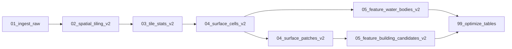

# Trimble Geospatial Demo

This repo contains a .NET 8 API and Databricks pipelines for processing LiDAR point
cloud data into tiles, surface models, and derived features (water bodies and
building candidates).

## Data source
Lidar was captured for Wellington City Council by Aerial Surveys between 2019 and
2020. The dataset was generated by Aerial Surveys and their subcontractors. The
survey area includes Wellington City and the surrounding area. Data management and
distribution is by Land Information New Zealand.

Dataset summary:
- Platform: Airborne LiDAR
- Survey area: 158 km2
- Point density: 23.29 pts/m2
- Survey date: 03/20/2019 - 03/14/2020

Metadata and licensing:
- Use license: CC BY 4.0
- Funder: WCC
- Partner: LINZ
- Collector: AS

Source: https://portal.opentopography.org/lidarDataset?opentopoID=OTLAS.092020.2193.1

## Databricks job flow (overview)
All processing runs in Databricks using notebooks in `databricks/pipelines`. The
workflow is designed as a DAG in Databricks Workflows and runs in this order:

1) 01_ingest_raw (no dependency)
2) 02_spatial_tiling_v2 depends on 01_ingest_raw
3) 03_tile_stats_v2 depends on 02_spatial_tiling_v2
4) 04_surface_cells_v2 depends on 03_tile_stats_v2
5) 04_surface_patches_v2 depends on 04_surface_cells_v2
6) 05_feature_water_bodies_v2 depends on 04_surface_cells_v2
7) 05_feature_building_candidates_v2 depends on 04_surface_patches_v2
8) 99_optimize_tables depends on both feature tasks

Goal:
Raw -> tiling -> tile stats -> surface cells -> surface patches -> features -> optimize

### Pipeline stages and tables
All tables are in Unity Catalog `main.demo`.

- Ingest:
  - Input: raw point cloud files
  - Output: `points_raw`
- Tiling:
  - Input: `points_raw`
  - Output: `processed_points_tiled_v2`
- Aggregation:
  - Input: `processed_points_tiled_v2`
  - Output: `tile_stats_v2`
- Surface:
  - Input: `processed_points_tiled_v2`, `tile_stats_v2`
  - Output: `surface_cells_v2`, `surface_patches_v2`
- Features:
  - Input: `surface_cells_v2`, `surface_patches_v2`
  - Output: `features_water_bodies_v2`, `features_building_candidates_v2`
- Optimization:
  - Input: all above tables
  - Output: optimized Delta files and statistics

### Notebooks by stage
See `databricks/pipelines` for the implementation. Key notebooks:

- `00_setup/`
  - `setup_external_locations.ipynb`
  - `setup_tiling_params.ipynb`
  - `create_site_lock_table.ipynb`
- `01_ingest/01_ingest_raw.ipynb`
- `02_processing/02_spatial_tiling_v2.ipynb`
- `03_aggregation/03_tile_stats_v2.ipynb`
- `04_surface/04_surface_cells_v2.ipynb`
- `04_surface/04_surface_patches_v2.ipynb`
- `05_feature/05_feature_water_bodies_v2.ipynb`
- `05_feature/05_feature_building_candidates_v2.ipynb`
- `99_optimization/99_optimize_tables.ipynb`

### Job parameters (defaults)
Configured at the job level and passed to notebooks via widgets or spark config:

- `siteId`: `wellington_cbd`
- `cellSizeM`: `0.5`
- `patchWaterThreshold`: `0.7`
- `skipWaterTileRatio`: `0.8`
- `targetIngestRunId`: empty (optional)

## API
The API is a .NET 8 ASP.NET Core Web API that serves the processed data.
Base path: `/api/v1`.

Swagger UI:
- Local: `http://localhost:<port>/swagger`
- Deployed: `https://<app>.azurewebsites.net/swagger`

All endpoints require an API key in the `x-api-key` header.

## Repo structure (high level)
- `api/`: ASP.NET Core API, Swagger, and data access
- `databricks/`: Databricks notebooks and workflow definitions
- `data-model/`, `architecture/`, `decisions/`: design docs and references

## Images

