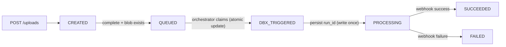

# Trimble Geospatial Demo

This repo contains a .NET 8 API and Databricks pipelines for processing LiDAR point
cloud data into tiles, surface models, and derived features (water bodies and
building candidates).

## Data source
Lidar was captured for Wellington City Council by Aerial Surveys between 2019 and
2020. The dataset was generated by Aerial Surveys and their subcontractors. The
survey area includes Wellington City and the surrounding area. Data management and
distribution is by Land Information New Zealand.

Dataset summary:
- Platform: Airborne LiDAR
- Survey area: 158 km2
- Point density: 23.29 pts/m2
- Survey date: 03/20/2019 - 03/14/2020

Metadata and licensing:
- Use license: CC BY 4.0
- Funder: WCC
- Partner: LINZ
- Collector: AS

Source: https://portal.opentopography.org/lidarDataset?opentopoID=OTLAS.092020.2193.1

## Upload api architecture

This diagram shows the end-to-end ingestion path for a single LAZ upload:

- The client requests an upload session from the API and uploads directly to ADLS via SAS.
- When the client marks the upload complete, the API validates the blob, records status in the Job DB, and enqueues a `job_init` message.
- A Function/worker consumes the queue message and triggers the Databricks job, which reads raw data from staging and writes Delta tables to Unity Catalog.
- The client polls the API for job status.


### Permissions (high level)
This is a simplified view of the identities involved, plus the auth mechanism used in this repo:

- Client -> API: API key via `x-api-key` header (see `ApiKeyMiddleware`).
- API -> Job DB (Azure SQL): `Authentication=Active Directory Default` (uses App Service Managed Identity in Azure; local dev uses your signed-in developer identity).
- API -> ADLS/Blob: issues short-lived write SAS.
  - Preferred: User Delegation SAS via `DefaultAzureCredential` (Managed Identity in Azure).
  - Fallback: storage account key (`STORAGE_ACCOUNT_KEY`) if User Delegation SAS is unavailable.
- API -> Service Bus: Shared Access Signature (SAS) via connection string (`SERVICEBUS__CONNECTION`).

Note: the sequence diagram shows JWT/OIDC as a possible client auth flow, but the current API implementation uses `x-api-key`.


### Job state machine (6-line)

| Current state | Trigger | Next state | Key idempotency / constraints |
| --- | --- | --- | --- |
| — | `POST /uploads` (new `Idempotency-Key`) | `CREATED` | `Idempotency-Key` must be unique; duplicate request returns the same job |
| `CREATED` | `POST /uploads/{uploadId}/complete` and blob exists | `QUEUED` | Only allow `CREATED → QUEUED`; duplicate `complete` returns success without changing state |
| `QUEUED` | Orchestrator consumes message and successfully claims | `DBX_TRIGGERED` | Atomic `UPDATE ... WHERE status=QUEUED`; trigger exactly once |
| `DBX_TRIGGERED` | Databricks `run_id` persisted successfully | `PROCESSING` | `run_id` written once; retries must not overwrite |
| `PROCESSING` | Databricks webhook on-success | `SUCCEEDED` | Terminal state; duplicate webhooks ignored |
| `PROCESSING` | Databricks webhook on-failure | `FAILED` | Terminal state; record `errorCode` / `errorMessage` |

One-liner you can memorize:

`CREATED → QUEUED → DBX_TRIGGERED → PROCESSING → SUCCEEDED/FAILED` (messages + webhooks are at-least-once, but state transitions are atomic so the overall behavior is exactly-once)



### Identity × Resource × Role matrix

| Identity | Resource | RBAC role | Purpose |
| --- | --- | --- | --- |
| GitHub CI Service Principal | Resource Group | `Contributor` (or split into `Website Contributor` + least privilege) | Deploy API / Function / infrastructure |
| GitHub CI Service Principal | App Service | `Website Contributor` | Publish Web App |
| GitHub CI Service Principal | Function App | `Website Contributor` | Publish Function |
| GitHub CI Service Principal | Azure Container Registry | `AcrPush` | Push Docker images |
| GitHub CI Service Principal | Key Vault | `Key Vault Secrets User` | Read deployment secrets |
| API App Service (Managed Identity) | Azure SQL DB | `db_datareader` / `db_datawriter` (AAD user in DB) | Write Job / Upload status |
| API App Service (Managed Identity) | Blob Storage | `Storage Blob Data Contributor` | Generate SAS / validate blobs |
| API App Service (Managed Identity) | Service Bus | `Service Bus Data Sender` | Send `job_init` messages |
| API App Service (Managed Identity) | Key Vault | `Key Vault Secrets User` | Read configuration |
| Orchestrator Function (Managed Identity) | Azure SQL DB | `db_datareader` / `db_datawriter` (AAD user in DB) | Update Job status |
| Orchestrator Function (Managed Identity) | Service Bus | `Service Bus Data Receiver` | Consume `job_init` |
| Orchestrator Function (Managed Identity) | Databricks Workspace | "Can Run" (workspace/job permissions) | Trigger Databricks jobs |
| Orchestrator Function (Managed Identity) | Key Vault | `Key Vault Secrets User` | Read webhook secret |
| Databricks Job / Webhook | Function HTTP endpoint | HMAC shared secret (non-RBAC) | Callback job completion status |

### UI vs CLI RBAC equivalence

What you do in the Azure Portal:

`Access control (IAM) → Add role assignment`

Is equivalent to the CLI:

```bash
az role assignment create \
  --assignee <principalId> \
  --role "<roleName>" \
  --scope <resourceScope>
```

## Databricks job flow (overview)
All processing runs in Databricks using notebooks in `databricks/pipelines`. The
workflow is designed as a DAG in Databricks Workflows and runs in this order:


1) 01_ingest_raw (no dependency)
2) 02_spatial_tiling_v2 depends on 01_ingest_raw
3) 03_tile_stats_v2 depends on 02_spatial_tiling_v2
4) 04_surface_cells_v2 depends on 03_tile_stats_v2
5) 04_surface_patches_v2 depends on 04_surface_cells_v2
6) 05_feature_water_bodies_v2 depends on 04_surface_cells_v2
7) 05_feature_building_candidates_v2 depends on 04_surface_patches_v2
8) 99_optimize_tables depends on both feature tasks

Goal:
Raw -> tiling -> tile stats -> surface cells -> surface patches -> features -> optimize

### Pipeline stages and tables
All tables are in Unity Catalog `main.demo`.

- Ingest:
  - Input: raw point cloud files
  - Output: `points_raw`
- Tiling:
  - Input: `points_raw`
  - Output: `processed_points_tiled_v2`
- Aggregation:
  - Input: `processed_points_tiled_v2`
  - Output: `tile_stats_v2`
- Surface:
  - Input: `processed_points_tiled_v2`, `tile_stats_v2`
  - Output: `surface_cells_v2`, `surface_patches_v2`
- Features:
  - Input: `surface_cells_v2`, `surface_patches_v2`
  - Output: `features_water_bodies_v2`, `features_building_candidates_v2`
- Optimization:
  - Input: all above tables
  - Output: optimized Delta files and statistics

### Notebooks by stage
See `databricks/pipelines` for the implementation. Key notebooks:

- `00_setup/`
  - `setup_external_locations.ipynb`
  - `setup_tiling_params.ipynb`
  - `create_site_lock_table.ipynb`
- `01_ingest/01_ingest_raw.ipynb`
- `02_processing/02_spatial_tiling_v2.ipynb`
- `03_aggregation/03_tile_stats_v2.ipynb`
- `04_surface/04_surface_cells_v2.ipynb`
- `04_surface/04_surface_patches_v2.ipynb`
- `05_feature/05_feature_water_bodies_v2.ipynb`
- `05_feature/05_feature_building_candidates_v2.ipynb`
- `99_optimization/99_optimize_tables.ipynb`

### Job parameters (defaults)
Configured at the job level and passed to notebooks via widgets or spark config:

- `siteId`: `wellington_cbd`
- `cellSizeM`: `0.5`
- `patchWaterThreshold`: `0.7`
- `skipWaterTileRatio`: `0.8`
- `targetIngestRunId`: empty (optional)

## API
The API is a .NET 8 ASP.NET Core Web API that serves the processed data.
Base path: `/api/v1`.

Swagger UI:
- Local: `http://localhost:<port>/swagger`
- Deployed: `https://<app>.azurewebsites.net/swagger`

All endpoints require an API key in the `x-api-key` header.

## Repo structure (high level)
- `api/`: ASP.NET Core API, Swagger, and data access
- `databricks/`: Databricks notebooks and workflow definitions
- `data-model/`, `architecture/`, `decisions/`: design docs and references

## Images
### Azure resource group


### Azure Databricks


