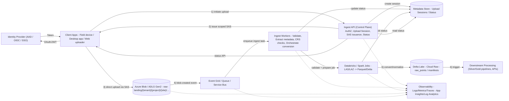

# Trimble-Style Ingest API Service (Architecture + Design Notes)

This document describes a **Trimble-style ingest service** for geospatial scan data (e.g., **LAS/LAZ**), designed for cloud-scale ingestion into **Delta Lake** and downstream **Databricks/Spark** processing.

> Key principle: **Control plane vs Data plane**
> - **Ingest API** (control plane): auth, permissions, metadata, orchestration
> - **Storage + Workers + Spark** (data/compute plane): file transfer, validation, conversion, normalization

---

## Architecture Diagram (Mermaid)



---

## What the Ingest Service Builds (Responsibilities)

### A) Ingest API (Control Plane)
**Responsibilities**
- Authenticate & authorize uploads (tenant/project/site permissions)
- Create an **upload session** (metadata + idempotency key)
- Issue **short-lived SAS** scoped to:
  - a specific blob path
  - limited permissions (typically write-only)
  - limited expiry (e.g., 15–60 minutes)
- Track upload lifecycle state:
  - `INITIATED -> UPLOADED -> VALIDATING -> CONVERTING -> READY`
- Expose upload status to clients

**Non-responsibilities**
- It does **not** stream large files through itself.
- It does **not** do heavy compute/format conversion.

---

### B) Ingest Workers + Conversion Jobs (Data / Compute Plane)
**Responsibilities**
- Validate file integrity (size, checksum, format)
- Extract metadata:
  - bounds (bbox)
  - point count
  - CRS / coordinate system checks
  - classification/intensity availability
- Convert LAS/LAZ into **cloud-native formats** (Parquet/Delta)
- Emit events / trigger downstream processing (Silver/Gold)

---

## Minimal API Endpoints (Interview-Grade)

### 1) Initiate an upload session
`POST /v1/uploads:initiate`

**Request**
```json
{
  "tenantId": "t1",
  "projectId": "p1",
  "siteId": "s1",
  "fileName": "scan_2025-12-22.laz",
  "contentType": "application/octet-stream",
  "expectedSizeBytes": 524288000,
  "checksum": "sha256:..."
}
```

**Response**
```json
{
  "uploadId": "u_123",
  "blobPath": "raw-landing/t1/p1/s1/u_123/scan.laz",
  "sasUrl": "https://.../scan.laz?<sas>",
  "expiresAt": "2025-12-22T03:30:00Z"
}
```

---

### 2) Client signals upload completion (control signal)
`POST /v1/uploads/{uploadId}:complete`

- Idempotent (safe to retry)
- Kicks off validation/conversion pipeline

---

### 3) Query upload status
`GET /v1/uploads/{uploadId}`

**Typical states**
- `INITIATED`
- `UPLOADED`
- `VALIDATING`
- `FAILED_VALIDATION`
- `CONVERTING`
- `READY`

---

### 4) List ingests for a site (optional)
`GET /v1/sites/{siteId}/uploads?status=READY`

---

## Key Design Decisions (What interviewers care about)

### 1) SAS-based Direct Upload
- Client uploads directly to Storage using SAS
- API remains a control plane (no data bottleneck)

### 2) Idempotency
- `initiate` supports idempotency key
- `complete` is safe to retry
- Workers/jobs can be rerun without creating duplicates

### 3) Multi-tenant Isolation
- Path layout includes tenant/project/site identifiers
- SAS is scoped to a single prefix/blob
- RBAC and managed identity protect storage access

### 4) Event-driven Orchestration
- Storage events trigger ingestion pipeline
- Decouples upload experience from heavy compute
- Improves reliability and scalability

### 5) Metadata Contract (Manifests)
Store metadata as a first-class output (e.g., `raw_manifests` Delta table):
- bounding box
- point count
- CRS
- available attributes (classification, intensity, return number)
- ingestion version + lineage

This becomes the contract for downstream Spark processing and serving APIs.

---

## Suggested Storage Layout

### Landing (untrusted, original format)
- `raw-landing/{tenant}/{project}/{site}/{uploadId}/original.laz`

### Cloud Raw (trusted, normalized for compute)
- `delta/raw_points` (Parquet/Delta)
- `delta/raw_manifests` (metadata + lineage)
- Optional archive: keep original LAZ in a colder tier for compliance

---

## 20-Second Interview Script

> “Ingest is a control-plane API plus an event-driven pipeline.  
> Clients request a short-lived SAS token, upload LAS/LAZ directly to ADLS, then signal completion.  
> Storage events trigger validation and conversion jobs (often on Databricks), producing cloud-native Delta tables plus metadata manifests.  
> This keeps uploads scalable, secure, and decoupled from heavy compute.”


## Code snippet

```csharp
// AppDbContext.cs
public class AppDbContext : DbContext
{
    public AppDbContext(DbContextOptions<AppDbContext> options) : base(options) { }

    public DbSet<UploadEntity> Uploads { get; set; }
}

// UploadEntity.cs
public class UploadEntity
{
    public long Id { get; set; }
    public long SiteId { get; set; }
    public string TenantId { get; set; } = string.Empty;
    public string ProjectId { get; set; } = string.Empty;
    public string FileName { get; set; } = string.Empty;
    public string Status { get; set; } = "PENDING";
    // 其他字段...
}

// UploadDto.cs
public class UploadDto
{
    public long Id { get; set; }
    public string FileName { get; set; } = string.Empty;
    public string Status { get; set; } = string.Empty;
}

// InitiateUploadRequest.cs
public class InitiateUploadRequest
{
    public string TenantId { get; set; } = string.Empty;
    public string ProjectId { get; set; } = string.Empty;
    public string SiteId { get; set; } = string.Empty;
    public string FileName { get; set; } = string.Empty;
    public string ContentType { get; set; } = string.Empty;
    public long ExpectedSizeBytes { get; set; }
    public string Checksum { get; set; } = string.Empty;
}

// InitiateUploadResponse.cs
public class InitiateUploadResponse
{
    public string UploadId { get; set; } = string.Empty;
    public string BlobPath { get; set; } = string.Empty;
    public string SasUrl { get; set; } = string.Empty;
    public DateTimeOffset ExpiresAt { get; set; }
}

// IUploadService.cs
public interface IUploadService
{
    Task<IEnumerable<UploadDto>> GetUploadsAsync(long siteId, string? status = null);
    Task<InitiateUploadResponse> InitiateUploadAsync(InitiateUploadRequest request, string idempotencyKey);
}

// UploadService.cs
public class UploadService : IUploadService
{
    private readonly AppDbContext _db;
    // 假设有 Azure Blob Service 客户端
    private readonly BlobServiceClient _blobClient;

    public UploadService(AppDbContext db, BlobServiceClient blobClient)
    {
        _db = db;
        _blobClient = blobClient;
    }

    public async Task<IEnumerable<UploadDto>> GetUploadsAsync(long siteId, string? status = null)
    {
        var query = _db.Uploads
            .Where(u => u.SiteId == siteId)
            .Select(u => new UploadDto
            {
                Id = u.Id,
                FileName = u.FileName,
                Status = u.Status
            });

        if (!string.IsNullOrEmpty(status))
        {
            query = query.Where(u => u.Status.Equals(status, StringComparison.OrdinalIgnoreCase));
        }

        return await query.ToListAsync();
    }

    public async Task<InitiateUploadResponse> InitiateUploadAsync(InitiateUploadRequest request, string idempotencyKey)
    {
        // 简化幂等性：这里仅示例逻辑，实际需加锁 + 数据库/Redis 记录
        var existing = await _db.Uploads
            .FirstOrDefaultAsync(u => u.IdempotencyKey == idempotencyKey);

        if (existing != null && existing.Status == "INITIATED")
        {
            // 返回已缓存的响应（实际需存储响应）
            return new InitiateUploadResponse { /* 从记录取 */ };
        }

        var uploadId = $"u_{Guid.NewGuid():N}";
        var blobPath = $"raw-landing/{request.TenantId}/{request.ProjectId}/{request.SiteId}/{uploadId}/{request.FileName}";

        var blobContainer = _blobClient.GetBlobContainerClient("uploads");
        var blob = blobContainer.GetBlobClient(blobPath);

        var sasBuilder = new BlobSasBuilder
        {
            BlobContainerName = "uploads",
            BlobName = blobPath,
            Resource = "b",
            ExpiresOn = DateTimeOffset.UtcNow.AddHours(1)
        };
        sasBuilder.SetPermissions(BlobSasPermissions.Write | BlobSasPermissions.Create);

        var sasUrl = blob.GenerateSasUri(sasBuilder).ToString();

        // 保存记录
        var entity = new UploadEntity
        {
            SiteId = long.Parse(request.SiteId),
            TenantId = request.TenantId,
            ProjectId = request.ProjectId,
            FileName = request.FileName,
            Status = "INITIATED",
            // IdempotencyKey = idempotencyKey
        };
        _db.Uploads.Add(entity);
        await _db.SaveChangesAsync();

        return new InitiateUploadResponse
        {
            UploadId = uploadId,
            BlobPath = blobPath,
            SasUrl = sasUrl,
            ExpiresAt = sasBuilder.ExpiresOn
        };
    }
}

// UploadsController.cs
[ApiController]
[Route("v1")]
public class UploadsController : ControllerBase
{
    private readonly IUploadService _service;

    public UploadsController(IUploadService service) => _service = service;

    [HttpGet("sites/{siteId}/uploads")]
    public async Task<ActionResult<IEnumerable<UploadDto>>> Get(
        long siteId,
        [FromQuery] string? status = null)
    {
        var uploads = await _service.GetUploadsAsync(siteId, status);
        return Ok(uploads);
    }

    [HttpPost("uploads:initiate")]
    public async Task<ActionResult<InitiateUploadResponse>> Initiate(
        [FromBody] InitiateUploadRequest request,
        [FromHeader(Name = "Idempotency-Key")] string? idempotencyKey)
    {
        if (string.IsNullOrWhiteSpace(idempotencyKey))
            return BadRequest("Idempotency-Key header is required.");

        var result = await _service.InitiateUploadAsync(request, idempotencyKey);
        return Ok(result);
    }
}

// Program.cs (关键注册)
builder.Services.AddDbContext<AppDbContext>(options => 
    options.UseSqlServer(connectionString));
builder.Services.AddScoped<BlobServiceClient>(sp => 
    new BlobServiceClient(blobConnectionString));
builder.Services.AddScoped<IUploadService, UploadService>();
```
